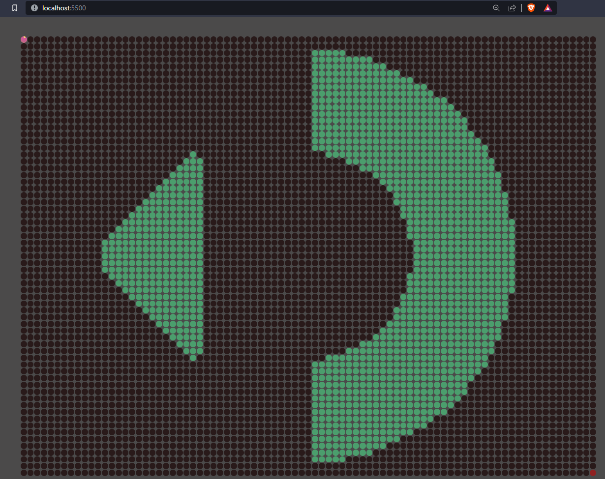

this repository is a nodejs 16+ javascript implementation of a solution of a celular automata maze traversal to reach the last square as goal. this was Brazilian code contest ocurried within domain of sigmageek.com sponsored by Stone.

it contains several complex implementation of efficient algorithms such like GBFS (greedy best-first search) I tried to implement, but in counterpart those are delivering wrong answers, in other words, something or a group of somethings are incorrect in the implemention.

### A challenge for curious visitors:
- you are free to try to debug this application you will sound a badass developer I couldn't yet.

You run the application with node . this includes a frontend which you can move the agent using key arrows and a simple server serving the html content on the 5500 port of the browser.

in order for you to run the solution and output the file this is the command: node solution.js.

